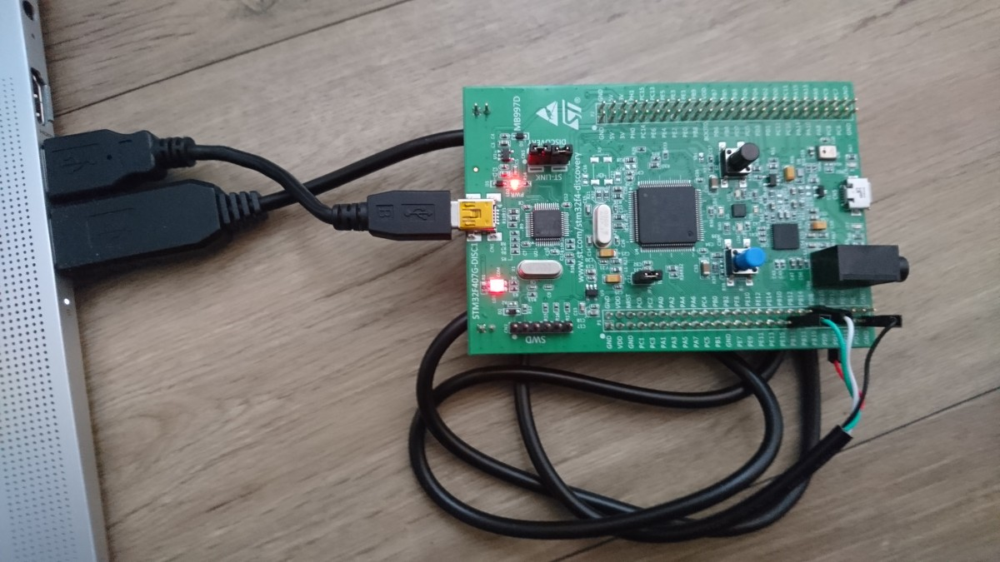

## Print text to serial console over UART

1. Connect your MCU to PC over Mini USB connector (internal ST-LINK module, needed for programming of MCU)
2. Connect your "USB to TTL RS232 converter" ([PL2303](https://www.aliexpress.com/item/1981712661.html)) to PC, also over Mini USB connector
3. Connect the converter, this time to MCU, using three wires:
    1. TX cable (green) to pin PB11 (USART3_RX)
    2. RX cable (white) to pin PD8 (USART3_TX)
    3. GND cable (black) to GND pin
> If you've already uploaded the app, feel free to disconnect ST-LINK from PC and connect the converter's fourth red cable to 5V on MCU. App should be still working.    
3. OS should detect new devices, one for STLink and one for serial port:
```
$ lsusb
Bus 001 Device 009: ID 067b:2303 Prolific Technology, Inc. PL2303 Serial Port
Bus 001 Device 008: ID 0483:374b STMicroelectronics ST-LINK/V2.1
```
> Tested on Ubuntu 19.04, other OS's might have different devices
4. Compile and upload app to MCU: **Platform IO: Upload**
5. Open **Platform IO: Serial Monitor**, you should get this:
```
> Executing task: platformio device monitor <

--- Miniterm on /dev/ttyUSB0  115200,8,N,1 ---
--- Quit: Ctrl+C | Menu: Ctrl+T | Help: Ctrl+T followed by Ctrl+H ---
```
> If it fails, check the config file `platform.ini` and change or remove the option `monitor_port = /dev/ttyUSB0`. PIO is able to detect and offer the right device.

> If you get an error "Device or resource busy", uninstall ModemManager: `apt remove modemmanager`

### If things work well, you should see repeating text "Hello world!" in [output](printfOverUART.webm).


